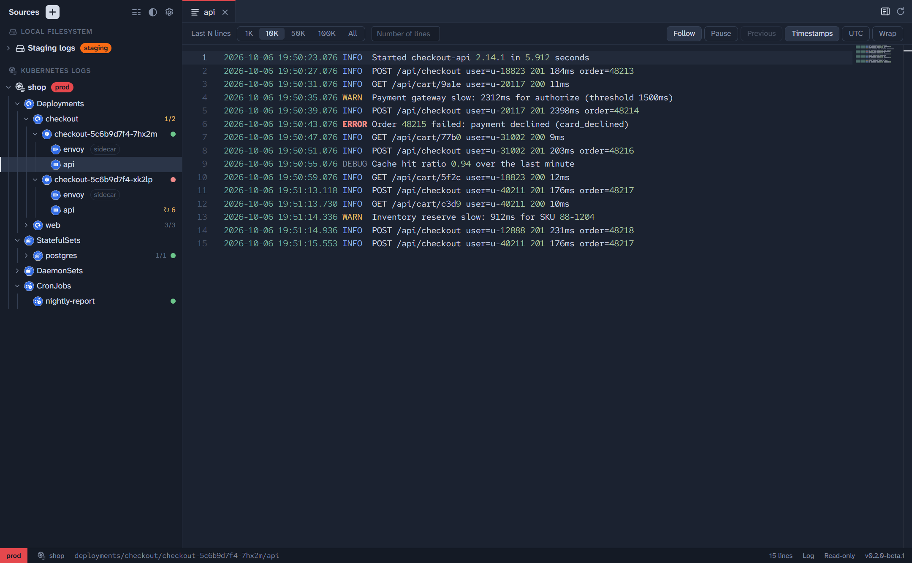
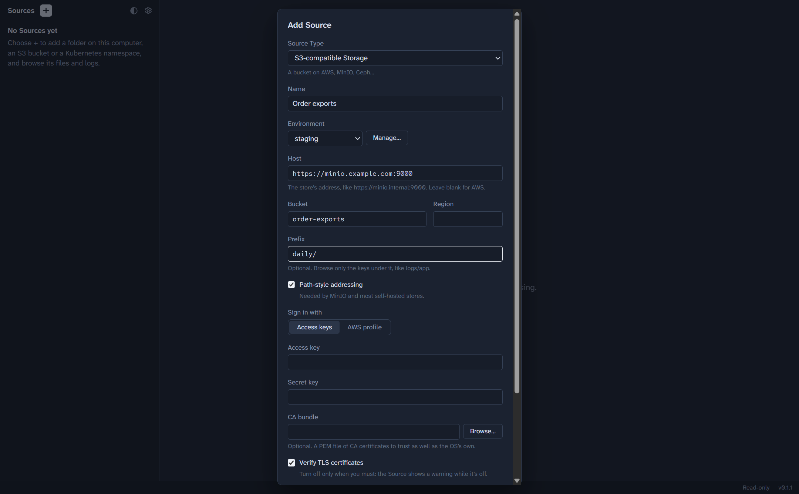
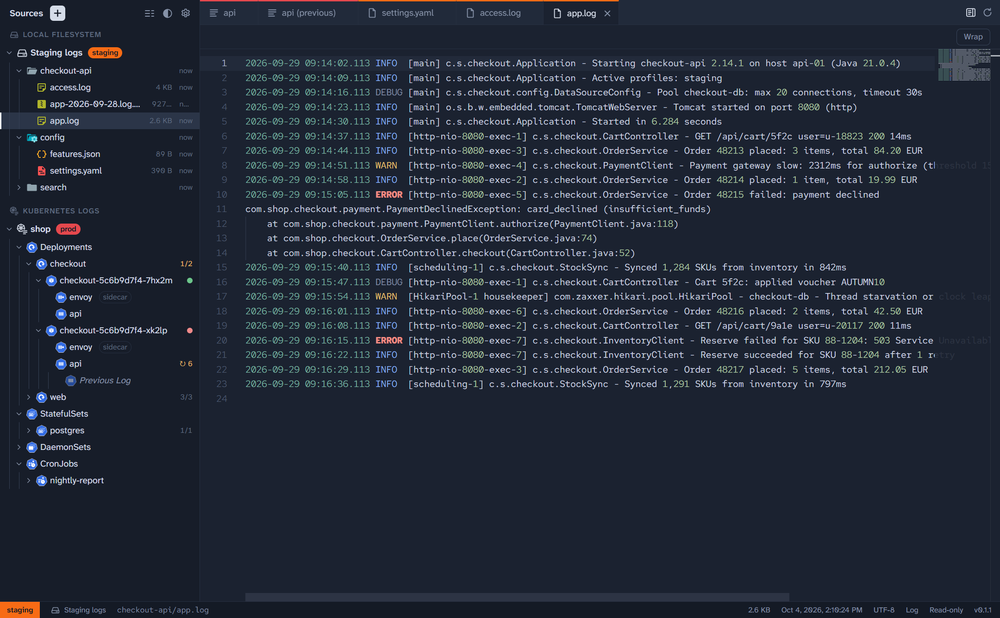
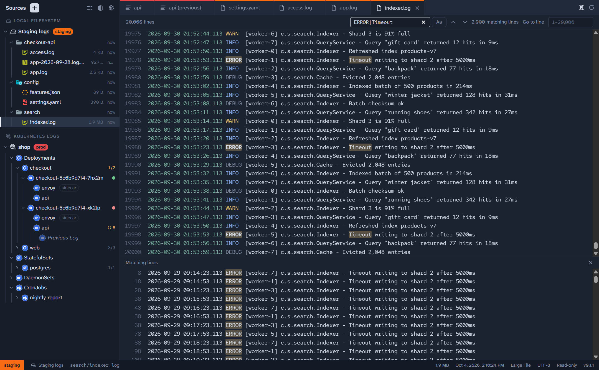
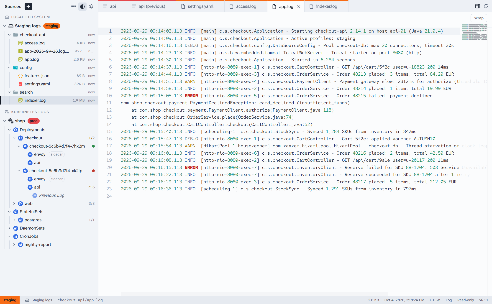

# Polyscope

**One desktop app for reading files and logs, wherever they live.** Browse a folder on your machine, an S3 bucket, the files inside a Kubernetes pod, or every container log in a namespace, side by side in one editor-like window.

## Why Polyscope

Chasing a problem across systems usually means a terminal per place, each with its own tool: `tail -f` for a server's files, the AWS console or `aws s3 cp` for archived logs, `kubectl logs` and `kubectl exec … cat` for a cluster. Each shows you text in a different way, loses your place when you switch, and makes it easy to lose track of which environment you're looking at.

Polyscope puts them all in one tree, read the same way:

- **Every place in one sidebar.** Local folders, S3-compatible buckets, files inside pods, and pod logs, each configured once as a **Source**.
- **A real viewer.** Tabs, syntax and log-level highlighting, search, a minimap, line wrapping, and gzip and zstd files shown decompressed. It's the editor that powers VS Code, opened read-only.
- **Logs that keep up.** Follow a container's log, or a growing file, live. Pause to read, and pick up where you left off. A crashed container's **Previous Log** is one click away.
- **Files of any size.** Files over 50 MB open end-first in a paged viewer that can jump to any line and search the whole file with a regular expression, without loading it all into memory.
- **Always know where you are.** Label Sources with an **Environment** like *prod* or *staging*. Its colour follows you onto every tab and the status bar.
- **Read-only and private.** Polyscope never writes to what it reads, collects no telemetry, and encrypts your secrets with your operating system's secure storage.

It runs on Windows, macOS and Linux, and [inside VS Code](#in-vs-code).

## What it reads

| Source Type | What it shows | Signs in with |
| --- | --- | --- |
| **Local Filesystem** | A folder on this machine, or a UNC share on Windows | Your own file permissions |
| **S3-compatible Storage** | A bucket, or the keys under a prefix, on AWS S3, MinIO, Ceph and others | Access keys, or an AWS profile (SSO included) |
| **Kubernetes Files** | A folder inside every pod of one Deployment, StatefulSet or DaemonSet | Your kubeconfig, as `kubectl` does |
| **Kubernetes Logs** | The logs of every container in a namespace, grouped by Workload, with pod health and restarts | Your kubeconfig, as `kubectl` does |

## Quick start

1. **Install** Polyscope from the [latest release](https://github.com/ducttapeworksorg/polyscope/releases/latest): the `.exe` installer on Windows, the `.dmg` on macOS, or the AppImage, `.deb` or `.rpm` on Linux. Can't install software? On Windows, the portable `.exe` or `.zip` runs without installing (see [Running without installing](docs/installing.md#running-without-installing)). The downloads aren't signed yet, so see [Installing](docs/installing.md) for getting past the first-run warning.
2. **Add a Source.** Choose **+** next to **Sources** at the top of the sidebar, pick a Source Type, fill in where it points, and choose **Test connection**, then **Add Source**.
3. **Browse.** Expand the Source to connect to it. Click a file or a container to preview it, double-click to keep it open in its own tab, and choose **Follow** to watch it grow.

## A closer look

Files open in a read-only editor with highlighting picked from the file's name. Logs get their levels, timestamps and numbers coloured. The status bar shows the file's Source, path, size, encoding and language, and you can change the last two there.

Files over the Large File threshold open in the **Large File Viewer**. It shows the end first, then lets you go to any line and search the whole file once it's cached.

There's a light theme too, a click away at the top of the sidebar.

## In VS Code

Polyscope also comes as an extension for VS Code and editors built on it (VSCodium, Cursor, Windsurf). Each release has it as `polyscope-<version>.vsix`, at the same version as the app. Install it with **Extensions → … → Install from VSIX…**, or `code --install-extension polyscope-<version>.vsix`.

The Polyscope icon in the activity bar opens the same Sources sidebar as the app. Files open read-only in VS Code's own editor, labelled with their Source and tinted with its Environment's colour. Followed files, Kubernetes Log Streams and Large Files open in a Polyscope viewer tab, which can append live lines and page through a multi-gigabyte file. Turn off the `polyscope.ownViewer` setting to open everything in VS Code's editor instead.

The extension keeps its own Sources, Environments and settings, apart from the app's, so add your Sources again there. Under Remote-SSH, WSL and Dev Containers it runs on the remote machine. See [Polyscope for VS Code](docs/installing.md#polyscope-for-vs-code) for more.

## Documentation

- [Installing and updating](docs/installing.md): downloads, first-run warnings on each system, how updates work, and Polyscope for VS Code
- [Sources](docs/sources.md): setting up each Source Type, and labelling Sources with Environments
- [Reading files and logs](docs/reading.md): tabs, following logs, Large Files, encodings, settings and keyboard shortcuts
- [Privacy](docs/privacy.md): what Polyscope connects to and what it stores
- [Development](docs/development.md): building, testing and releasing Polyscope

## Reporting a bug

Please [open an issue on GitHub](https://github.com/ducttapeworksorg/polyscope/issues). To help us reproduce it, open **Settings → Help → Copy diagnostics** and paste the result into the issue. It contains the Polyscope, OS and Electron versions (VS Code's, in the extension) and the recent app log. Secret keys, tokens, passwords, credential-bearing URLs and your home folder's path are removed first, but read it over before you post it.

To report a security problem, please email [ducttapeworks@proton.me](mailto:ducttapeworks@proton.me) rather than opening a public issue.

## License

[Apache-2.0](LICENSE). Polyscope is provided "as is", without warranty of any kind, and its authors aren't liable for any damage arising from its use. See sections 7 and 8 of the license.
