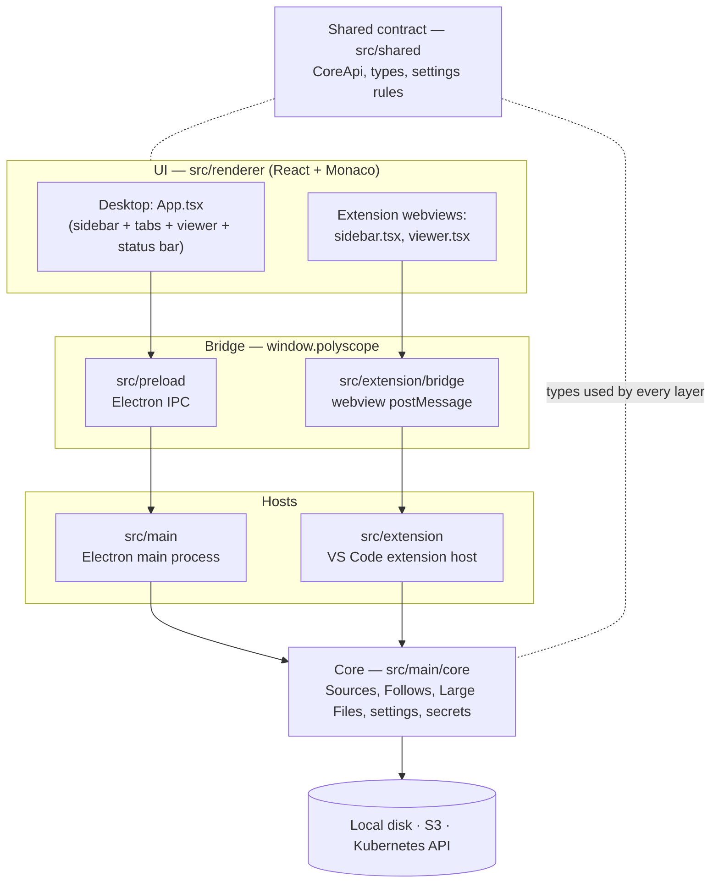
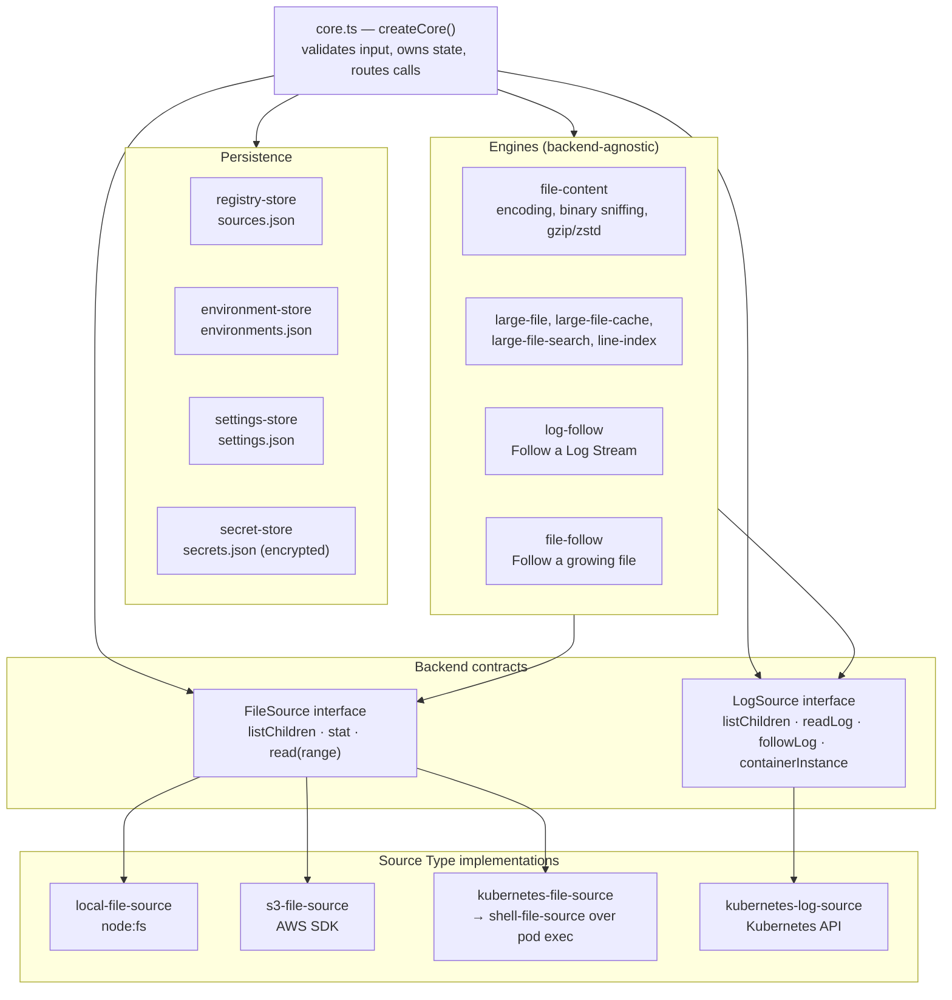
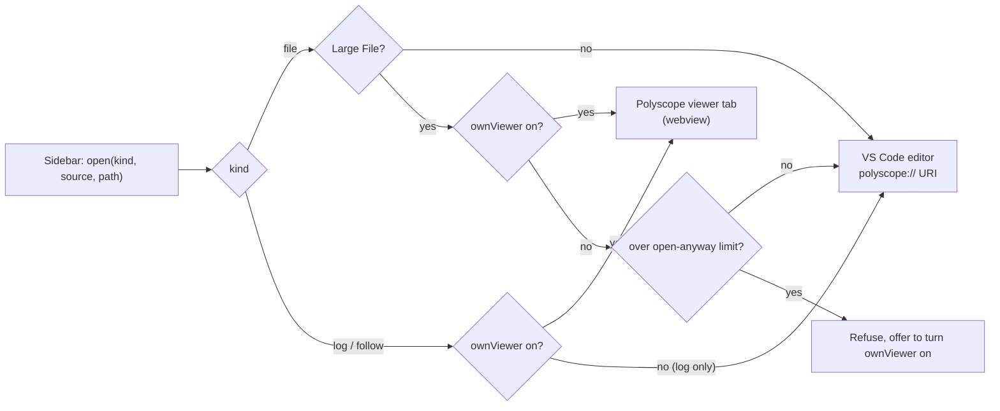
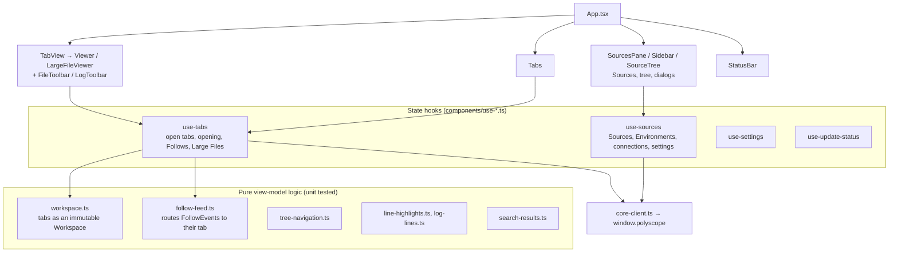
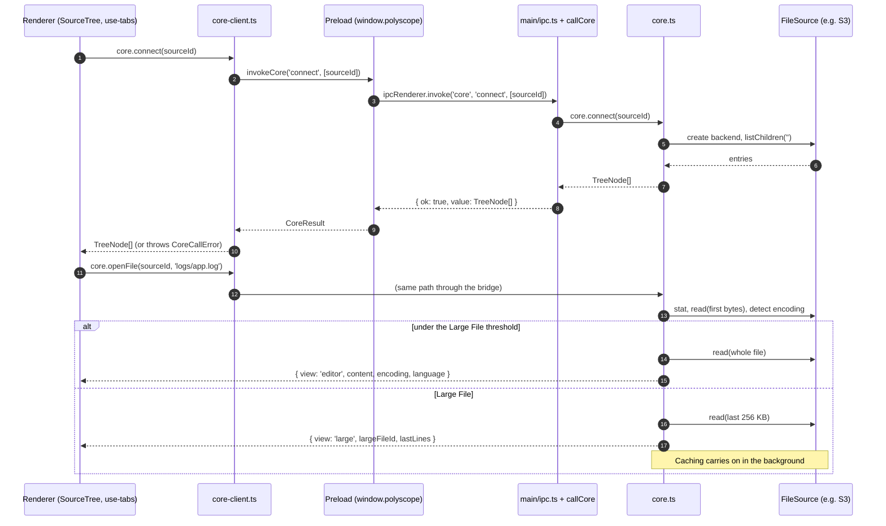
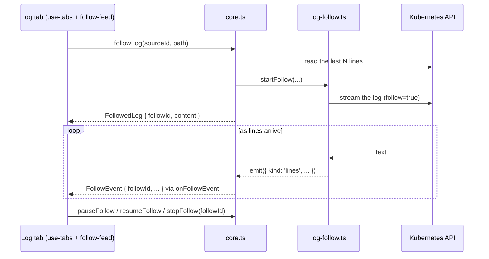
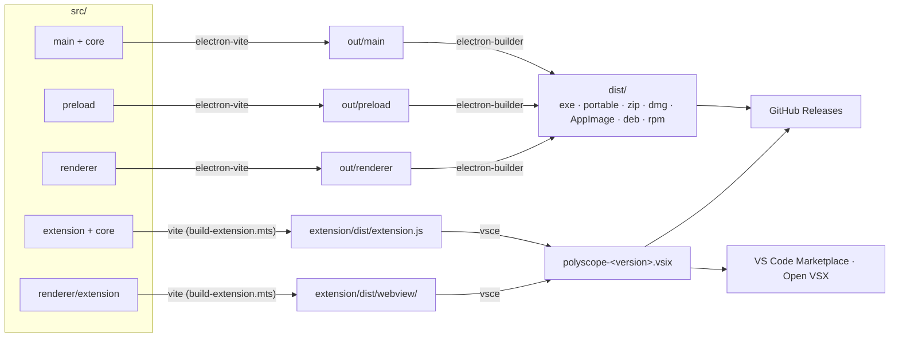

# Architecture

This is a map of how Polyscope is built: which layers it has, what each one owns, how they talk to each other, and where new code goes. It's written for developers joining the project, whatever they worked on before. If you've built web apps, backend services, or VS Code extensions, the [Mental model](#mental-model) section translates Polyscope's pieces into terms you already know.

Related reading:

- [`GLOSSARY.md`](../GLOSSARY.md): the domain's vocabulary (Source, Source Type, Environment, Follow, Large File…). This doc uses those terms as defined there.
- [`docs/adr/`](adr/): why things are the way they are (Electron, the Extension Copy, updates, portable builds).
- [Development](development.md): building, testing, debugging and releasing.

## Contents

- [At a glance](#at-a-glance)
- [Mental model](#mental-model)
- [Tech stack](#tech-stack)
- [Repository map](#repository-map)
- [The layers](#the-layers)
  - [1. Shared contract](#1-shared-contract-srcshared)
  - [2. Core](#2-core-srcmaincore)
  - [3. Hosts](#3-hosts-srcmain-and-srcextension)
  - [4. Bridge](#4-bridge-srcpreload-and-srcextensionbridge)
  - [5. UI](#5-ui-srcrenderer)
- [How the layers interact](#how-the-layers-interact)
- [State and persistence](#state-and-persistence)
- [Errors](#errors)
- [Security model](#security-model)
- [Build, packaging and distribution](#build-packaging-and-distribution)
- [Testing](#testing)
- [Where does it go?](#where-does-it-go)
- [Adding a Source Type](#adding-a-source-type)

## At a glance

Polyscope is a read-only viewer for files and logs from several kinds of backend: local folders, S3-compatible buckets, files inside Kubernetes pods, and Kubernetes container logs. It ships in two forms that share almost all their code:

- **The desktop app**: an Electron app for Windows, macOS and Linux.
- **The Extension Copy**: a VS Code extension that runs the same core and the same UI components inside VS Code (ADR 0005).

The whole codebase is TypeScript. It splits into five layers:



The one idea to hold onto: **the core is a plain Node.js library with a single typed API (`CoreApi`), and everything else is a way of reaching it.** The UI never touches a disk, a bucket or a cluster; it asks the core. The core never touches the DOM or Electron; a host hands it what it needs.

## Mental model

Polyscope's layers line up with ones you've probably seen elsewhere:

| Polyscope | If you come from web/backend | If you come from desktop/mobile |
| --- | --- | --- |
| **Core** (`src/main/core`) | The backend service: domain logic, data access, integrations | The model/service layer |
| **`CoreApi`** (`src/shared/core-api.ts`) | The API schema (like an OpenAPI spec or a gRPC `.proto`), shared by client and server | The service interface |
| **Electron main process** (`src/main`) | The server process hosting the service, plus OS access (dialogs, clipboard, updates) | The app delegate / application host |
| **IPC / `postMessage`** | HTTP/RPC transport | Platform channels / XPC |
| **Preload** (`src/preload`) | A generated API client, exposed as `window.polyscope` | The binding layer |
| **Renderer** (`src/renderer`) | A React single-page app, no router, no server rendering | The view layer |
| **Core events** (`onFollowEvent`…) | Server push (WebSocket/SSE) | Notifications / observers |

Electron runs an app as at least two processes. The **main process** is Node.js: it can use the filesystem, the network and native libraries. The **renderer process** is Chromium showing a web page, sandboxed, with no Node.js at all. They talk through IPC (inter-process communication), which serializes messages much as HTTP does. Polyscope's renderer is locked down (`contextIsolation`, `sandbox`, no `nodeIntegration`), so the only way it can do anything outside its page is through the small `window.polyscope` object the preload script exposes.

A VS Code extension has the same split: the **extension host** is a Node.js process (main's counterpart), and **webviews** are sandboxed web pages (the renderer's), talking through `postMessage`. That's why the same core and UI fit both.

## Tech stack

| Concern | Choice | Notes |
| --- | --- | --- |
| Language | TypeScript (strict, `noUncheckedIndexedAccess`) everywhere | One language across processes (ADR 0002) |
| Desktop shell | [Electron](https://www.electronjs.org/) | Chosen over Tauri/Wails for identical rendering on every OS (ADR 0002) |
| Build | [electron-vite](https://electron-vite.org/) (Vite) for the app; Vite directly (`scripts/build-extension.mts`) for the extension | `@shared/*` path alias in every bundle |
| UI | React 19, plain CSS (`src/renderer/src/styles/app.css`) | No state library, no router, no CSS framework |
| Editor | [Monaco](https://microsoft.github.io/monaco-editor/), the editor in VS Code, read-only | Its language workers are set up in `monaco.ts` |
| S3 | `@aws-sdk/client-s3` | Keys, or AWS profiles including SSO |
| Kubernetes | `@kubernetes/client-node` | Uses the user's kubeconfig, as `kubectl` does; exec over WebSocket for pod files |
| Updates | `electron-updater` + GitHub Releases | Installed where possible, offered as a download elsewhere (ADR 0003) |
| Packaging | `electron-builder` (NSIS, portable, zip, dmg, AppImage, deb, rpm); `@vscode/vsce` for the `.vsix` | `electron-builder.yml` |
| Unit/integration tests | Vitest | `src/**/*.test.ts` |
| End-to-end tests | Playwright (driving Electron), `@vscode/test-electron` (driving VS Code) | `tests/smoke`, `tests/extension` |
| CI/CD | GitHub Actions | `.github/workflows/ci.yml`, `release.yml` |

Everything but `electron-updater` is a `devDependency`, because Vite bundles it into the app. `electron-updater` is left out of the bundle and shipped from `node_modules` by electron-builder.

## Repository map

```text
src/
  shared/          The contract between layers. Types and pure rules only; no Node or DOM APIs.
    core-api.ts      CoreApi, CoreEvents, every request/response type, error codes
    settings.ts      Settings, their defaults and validation (used by core and Settings dialog alike)
    search.ts        Building the search RegExp (core and UI must agree)
    updates.ts       Update status types
  main/            The Electron main process (desktop host)
    index.ts         App start-up: window, security settings, wiring core to IPC
    ipc.ts           IPC handlers: core calls, events, dialogs, clipboard, updates, diagnostics
    core-call.ts     Dispatches a serialized call to the core, turning errors into values
    updates.ts, update-engines.ts   Self-update logic (ADR 0003)
    app-log.ts, diagnostics.ts, redact.ts   Local log and "Copy diagnostics"
    login-shell-path.ts   Loads the login shell's PATH (for kubeconfig exec plugins)
    core/            THE CORE: host-independent Node.js library
  preload/         The desktop bridge: exposes window.polyscope over IPC
  renderer/
    index.html       The desktop page
    src/             The UI: React components, hooks, view-model logic, Monaco setup, i18n, styles
    extension/       Entry pages for the Extension Copy's webviews (sidebar, viewer tab)
  extension/       The VS Code extension host: activation, FileSystemProvider, webviews, SecretStorage
    bridge/          postMessage bridge: protocol, host side, webview side
extension/         The extension's manifest (package.json), README and icon; builds land in extension/dist
tests/
  smoke/           Playwright tests against the built desktop app
  extension/       Integration tests in a real VS Code
  kind/            Kubernetes objects the Kubernetes integration tests seed a cluster with
scripts/           Extension build, icon rendering, README screenshots
build/             App icon and NSIS installer script
docs/              User docs, ADRs, this file
```

## The layers

### 1. Shared contract (`src/shared`)

The contract every other layer agrees on. Its main file, `core-api.ts`, defines:

- **`CoreApi`**: every request the UI can make, as `async` methods: Source management (`addSource`, `editSource`…), connecting and browsing (`connect`, `expand`), reading (`openFile`, `openLog`, `readLargeFileLines`…), following (`followLog`, `followFile`, `pauseFollow`…), helpers for dialogs (`listKubeContexts`, `listAwsProfiles`…), and settings.
- **`CoreEvents`**: what the core pushes without being asked: settings changes, Follow updates, Large File caching progress, Large File search results.
- **The data types** passed both ways: `NewSource` (what a dialog submits), `SourceInfo` (what the core hands out), `TreeNode` (rows in the sidebar tree), `OpenedFile` (a file ready to show), `FollowEvent`, and so on. Most are discriminated unions on `type`, `kind` or `view`, so a `switch` narrows them.
- **`CoreErrorCode`**: every way a call can fail, as a string code the UI maps to a message.
- **`coreMethods`**: the list of method names, used at runtime to reject unknown calls.

Rules for this layer:

- **Everything must survive serialization.** These values cross IPC (structured clone) and `postMessage` (JSON), so no functions, classes, `Map`s or `Date`s. Bytes travel as `Uint8Array` only where noted, and timestamps as numbers or RFC 3339 strings.
- **No platform APIs.** It's imported by Node code and browser code alike.
- **Rules both sides need live here.** `settings.ts` validates settings for the core (which enforces them) and for the Settings dialog (which checks as you type), so the two can't disagree.

### 2. Core (`src/main/core`)

The core is where Polyscope's behaviour lives. It's a Node.js library with no dependency on Electron or VS Code: `createCore({ dataDir, secrets, cacheDir })` returns an object implementing `CoreApi & CoreEvents` (plus `CoreFiles`, a few extra reads the VS Code file system provider needs). Each host constructs one and passes in where to keep data and how to encrypt secrets.

Inside, it's organized as a façade over pluggable backends:



#### The façade: `core.ts`

`createCore` holds the core's in-memory state and implements every `CoreApi` method:

- **The registry**: the list of Sources and the order of their sidebar groups, loaded from disk at start-up. Every change goes through `commit()`, which applies it, saves it, and rolls the in-memory state back if saving fails.
- **Connections**: a `Map` from Source id to its state (`connecting`, `connected` with its backend, or `error`). No entry means Disconnected. `connect()` builds a backend for the Source and lists its root. `disconnect()` drops it, stopping its Follows and Large File caching.
- **Open Large Files, Follows and searches**, by id, so the UI can refer to them in later calls.
- **Validation**: every input from the UI is checked and normalised here (URLs, namespaces, line counts, encodings…), because the UI is untrusted input as far as the core is concerned.

#### Backend contracts: `FileSource` and `LogSource`

Every Source Type implements one of two small interfaces, and the façade and engines only ever talk to those interfaces:

- **`FileSource`** (`file-source.ts`): `listChildren(path, cursor?)` (paged), `stat(path)`, `read(path, { offset, length })`, and optionally `foldedChild(path)`. Byte-range reads are the key design choice: they let the core read a file's last lines, sniff its encoding, or page through a multi-gigabyte file without downloading all of it, on every backend.
- **`LogSource`** (`log-source.ts`): `listChildren` (groups → Workloads → pods → containers), `logStreamAt`, `readLog` (tail lines, timestamps, Previous Log), `followLog` (a live connection), `containerInstance` (to notice restarts).

Paths are Source-relative and `/`-separated, with `''` for the root, whatever the backend. Backends throw `CoreError` with a code, never raw SDK errors.

Each interface has a **contract test suite** (`file-source-contract.ts`, `log-source-contract.ts`) that each implementation runs against its own backend, so they all behave alike.

#### Source Type implementations

| Source Type | Implementation | How it reaches its backend |
| --- | --- | --- |
| Local Filesystem | `local-file-source.ts` | `node:fs`; on Windows, `cmd.exe dir /a:h` to find hidden files |
| S3-compatible Storage | `s3-file-source.ts` | `@aws-sdk/client-s3` (`ListObjectsV2`, `HeadObject`, ranged `GetObject`); custom CA bundles and proxies |
| Kubernetes Files | `kubernetes-file-source.ts` → `shell-file-source.ts` + `kubernetes-exec.ts` | Finds the Workload's pods through the Kubernetes API, then runs small POSIX `sh` scripts (`stat`, `dd`…) in the container over the exec API, as `kubectl exec` does |
| Kubernetes Logs | `kubernetes-log-source.ts` | Kubernetes API: lists Workloads, pods and containers; reads and streams container logs |

Supporting modules: `kubeconfig.ts` (loads `KUBECONFIG` or `~/.kube/config`), `kubernetes-api.ts` (shared API helpers and error mapping), `pod-status.ts` (Pod Status and Ready Count), `rbac.ts`, `aws-profiles.ts`, `proxy-env.ts`, `network-errors.ts`.

`shell-file-source.ts` is a `FileSource` built on any "run this `sh` script" function, and so isn't tied to Kubernetes. A future backend you reach by running commands (SSH, say) could reuse it.

#### Engines

These do the heavy lifting on top of the contracts, so every backend gets them for free:

- **`file-content.ts`**: decides how to show bytes: detects text encodings and binary files, decompresses gzip and zstd as a stream, makes hex dumps.
- **Large Files** (`large-file.ts`, `large-file-cache.ts`, `line-index.ts`, `large-file-search.ts`): a file over the threshold (50 MB by default) opens end-first. The core reads its last lines straight away, then copies the whole file into a size-capped LRU disk cache in the background (local, uncompressed files are read in place instead), building a sparse index of line offsets as it goes. After that, `readLargeFileLines` can jump to any line, and `searchLargeFile` runs a regex over the cached file, streaming matches back as events.
- **Follows** (`log-follow.ts`, `file-follow.ts`): keep a view up to date. A Log Stream Follow holds a streaming connection to the Kubernetes API, reconnecting with backoff and carrying on across container restarts. A file Follow polls `stat` and reads what was added, noticing when the file is truncated or rotated. Both can pause, holding back at most the view's "Last N lines" until resumed.

#### Persistence and secrets

`registry-store`, `environment-store`, `settings-store` and `secret-store` each own one JSON file in `dataDir`, written through `json-file.ts`. The secret store encrypts each value with a `cipher` the host provides (Electron's `safeStorage` on the desktop) or swaps in an entirely different store (VS Code's `SecretStorage` in the extension). Secrets never leave the core: `SourceInfo` only says whether one is set (`secretKeySet`).

### 3. Hosts (`src/main` and `src/extension`)

A host starts the core and connects it to the outside world. There are two, and the core can't tell which one it's running under.

#### Desktop host: the Electron main process (`src/main`)

`index.ts` runs at start-up:

1. Picks the user-data folder (`Ducttapeworks/Polyscope`, or `Polyscope Dev` for a build run from source) and starts the app log.
2. Waits for the login shell's PATH (`login-shell-path.ts`). An app started from a macOS Dock or Linux launcher doesn't get it otherwise, and kubeconfig exec plugins (`aws`, `gke-gcloud-auth-plugin`…) need it.
3. Creates the core, with secrets encrypted by `safeStorage` (the OS keychain, DPAPI, or libsecret/KWallet).
4. Registers IPC handlers (`ipc.ts`) and forwards core events to the window.
5. Creates the `BrowserWindow` with the renderer locked down, and blocks navigation and new windows (`https:` links open in the OS browser).
6. Starts the updater in packaged builds (`updates.ts`, `update-engines.ts`).

Besides the core, the main process owns what needs the OS: native folder and file pickers, the clipboard, the window's theme, updates, and "Copy diagnostics" (the app log with secrets and the home folder redacted by `redact.ts`).

#### VS Code host: the extension host (`src/extension`)

`extension.ts` `activate()` does the same job inside VS Code:

1. Creates the core over the extension's global storage folder, with secrets in VS Code's `SecretStorage` (`secret-storage.ts`).
2. Registers a read-only **`FileSystemProvider`** for the `polyscope://<sourceId>/<path>` scheme (`file-provider.ts`, `polyscope-uri.ts`), so VS Code's own editor can open Source files.
3. Registers the **sidebar webview view** (`sidebar-view.ts`), which shows Polyscope's Sources pane.
4. Opens **viewer webview tabs** (`viewer-tab.ts`) for Follows, Log Streams and Large Files, which VS Code's editor can't show (ADR 0005).
5. Decorates `polyscope://` tabs with their Environment's colour (`tab-decorations.ts`, `environment-colors.ts`).

Its `open()` function decides where each thing the sidebar asks for goes, depending on `polyscope.ownViewer`:



### 4. Bridge (`src/preload` and `src/extension/bridge`)

The bridge carries calls and events between the UI and its host. The UI only ever sees one interface, **`PolyscopeBridge`** (`src/preload/bridge.ts`), as `window.polyscope`:

- `invokeCore(method, args)`: call any `CoreApi` method.
- Shell helpers: `pickFolder`, `pickFile`, `copyText`, `copyDiagnostics`, `secretStorageIsWeak`.
- Updates: `appVersion`, `getUpdateStatus`, `checkForUpdates`, `applyUpdate`.
- Subscriptions: `onSettingsChanged`, `onFollowEvent`, `onLargeFileEvent`, `onLargeFileSearchEvent`, `onUpdateStatus`, each returning an unsubscribe function.
- `copy`: `'desktop'` or `'extension'`, for the few places the UI differs.

It has two implementations:

| | Desktop | Extension Copy |
| --- | --- | --- |
| UI side | `src/preload/index.ts`, via `contextBridge` | `src/extension/bridge/webview.ts`, installed by `src/renderer/extension/bridge.ts` |
| Transport | `ipcRenderer.invoke('core', method, args)` / `webContents.send` | `postMessage` with `{ kind: 'call', id, method, args }` / `{ kind: 'reply', id, … }` / `{ kind: 'event', … }` (`protocol.ts`) |
| Host side | `src/main/ipc.ts` | `src/extension/bridge/host.ts` (`serveBridge`) |
| Extras | — | `ExtensionBridge` adds `open`, `retitle`, `ownViewer`, `openExtensionSettings` |

Both host sides call the core through the same function, **`callCore`** (`src/main/core-call.ts`). It checks the method name against `coreMethods`, calls it, and returns a `CoreResult`: `{ ok: true, value }` or `{ ok: false, code, message }`. Errors travel as values because a thrown `Error` loses its `code` crossing IPC. The extension's host side also remembers the Follows and Large Files each webview started, and lets them go when that webview closes.

On the UI side, **`core-client.ts`** wraps `invokeCore` into a typed `core` object implementing `CoreApi & CoreEvents`, turning a failed `CoreResult` back into a thrown `CoreCallError` with its code. **UI code imports `core` from `core-client.ts` and never calls `window.polyscope.invokeCore` itself.**

### 5. UI (`src/renderer`)

A React app with no external state library. State lives in a few hooks and in pure functions that are easy to unit test.



Key pieces:

- **`App.tsx`**: the desktop layout: sidebar, tab strip, viewer and status bar, plus app-wide keyboard shortcuts.
- **`components/use-sources.ts`**: the Sources, Environments, settings and each Source's connection state, mirrored from the core. Owns connect/disconnect and the dialogs' open state.
- **`components/use-tabs.ts`** + **`workspace.ts`**: the open tabs. `workspace.ts` holds the tab state as an immutable `Workspace` and pure functions over it (`openTab`, `closeTab`, `pinTab`, `endFollow`…). `use-tabs.ts` does the side effects: calling the core to open files and logs, and stopping a Follow or closing a Large File once no tab shows it. Tabs live only in memory and are never saved.
- **`follow-feed.ts`**: one subscription to `onFollowEvent`, routing each update to the tab that owns its `followId`. It queues updates that arrive before the tab has attached.
- **`source-types.tsx`**: the UI's per-Source-Type registry (`SourceTypeUi`): label, icon, blank settings, dialog fields, and how to show a path. The UI-side counterpart of the core's Source Type implementations.
- **`monaco.ts`**: Monaco's set-up: language workers, themes, the log-highlighting language.
- **`Viewer.tsx`** (Monaco, for normal files and logs) and **`LargeFileViewer.tsx`** (a virtualized, paged list that asks the core for lines as you scroll).
- **`i18n/`**: every user-visible string is in `i18n/en.ts` and read with `t('key', { vars })`. Error codes map to messages as `error.<CODE>`.
- **`styles/app.css`**: one stylesheet, themed by CSS custom properties. In the Extension Copy, `webview.css` maps them to VS Code's theme colours.

**Reuse in the Extension Copy.** `src/renderer/extension/sidebar.tsx` mounts the same `SourcesPane` with `useSources`. `viewer.tsx` mounts the same `TabView` with `useTabs` for a single tab. Only the entry points differ, which is why components take callbacks such as `onOpenFile` rather than opening tabs themselves: on the desktop they open a tab, in VS Code they ask the extension host to.

## How the layers interact

### Request/response: connecting a Source and opening a file



In the Extension Copy, steps 2–4 go through `postMessage` and `serveBridge` instead, and everything else is the same.

### Push: Follows and other events

Long-running work is started by a call and then reports through events. The call returns an id, and events carry it:



The same pattern covers Large Files (`openFile` → `largeFileId` → `LargeFileEvent` caching progress) and Large File search (`searchLargeFile` → `searchId` → `LargeFileSearchEvent` matches). On the desktop, `forwardCoreEvents` in `ipc.ts` sends every core event to the window. In the extension, `serveBridge` sends them to each webview.

**Clean-up rule:** whoever starts a Follow or opens a Large File must stop or close it. `use-tabs` does this when the last tab showing one closes. `serveBridge` does it when a webview goes away. Disconnecting a Source stops all its activity in the core.

### Dependency rules

| Layer | May import | Must not import |
| --- | --- | --- |
| `src/shared` | Nothing outside itself | Node, DOM, Electron, VS Code, React |
| `src/main/core` | `src/shared`, Node, SDKs (AWS, Kubernetes) | Electron, `vscode`, renderer code |
| `src/main` (outside `core`) | Core, shared, Electron | `vscode`, renderer components |
| `src/extension` | Core, shared, `vscode`, a few framework-free renderer helpers (`i18n`, `environments.ts`) | Electron, React components |
| `src/preload` | Shared, Electron's `contextBridge`/`ipcRenderer` | Core |
| `src/renderer` | Shared, `core-client.ts`, React, Monaco | Core, Node, Electron, `vscode` |

The three `tsconfig.*.json` projects enforce most of this: `tsconfig.web.json` (renderer, DOM types, no Node), `tsconfig.node.json` (main, preload, core) and `tsconfig.extension.json` (extension host, with `vscode` types). `npm run typecheck` checks all three.

## State and persistence

| State | Owner | Where it lives | Survives restart? |
| --- | --- | --- | --- |
| Sources and group order | Core (`registry-store`) | `sources.json` in the data folder | Yes |
| Environments | Core (`environment-store`) | `environments.json` | Yes |
| Settings | Core (`settings-store`) | `settings.json` | Yes |
| Secrets (S3 secret keys) | Core (`secret-store`) | `secrets.json`, encrypted with `safeStorage`; VS Code `SecretStorage` in the extension | Yes |
| Large File cache | Core (`large-file-cache`) | `large-file-cache/` in the data folder, LRU-capped by `cacheSizeCap` | Yes (reused if the file hasn't changed) |
| App log | Host (`app-log.ts`) | `logs/` in the data folder | Yes, rotated |
| Connections, Follows, open Large Files | Core, in memory | — | No: every Source starts Disconnected |
| Tabs, tree expansion, selection | Renderer, in memory | — | No (VS Code restores its own editor tabs) |
| Sidebar width | Renderer | `localStorage` | Yes |

The data folder is `Ducttapeworks/Polyscope` in the OS's app-data folder for installed and portable copies, `Ducttapeworks/Polyscope Dev` for builds run from source, and the extension's global storage folder for the Extension Copy. See [Development](development.md).

**The core is the single source of truth.** The renderer holds copies, refreshes them after changing something (`reloadSources`), and listens for `onSettingsChanged`. It never writes these files itself.

## Errors

1. A backend fails, e.g. S3 returns 403 or a pod is gone.
2. The backend implementation maps it to a `CoreError` with a `CoreErrorCode` (`PERMISSION_DENIED`, `POD_GONE`, `CREDENTIALS_UNAVAILABLE`…). Helpers such as `kubernetes-api.ts`'s `asCoreError` and `network-errors.ts` do the mapping.
3. `callCore` catches it and returns `{ ok: false, code, message }`, logging a warning (or an error, for anything that isn't a `CoreError`).
4. `core-client.ts` throws a `CoreCallError` with the same code.
5. The UI shows `describeError(error)`, the `error.<CODE>` message from `i18n/en.ts` with the raw message filled in.

Failures *inside* a tree are data, not exceptions: `expand` returns an `ErrorNode` in place of children, so one unreadable folder doesn't break the tree. A new failure mode needs a new code in `CoreErrorCode` and an `error.<CODE>` message in `en.ts`.

## Security model

- **Read-only.** No `FileSource` or `LogSource` method writes. The Kubernetes Files shell scripts only read (`stat`, `dd`, `ls`-like loops).
- **A locked-down renderer.** `contextIsolation: true`, `sandbox: true`, `nodeIntegration: false`. Navigation and pop-ups are blocked. The renderer can only call what `window.polyscope` exposes, and the core validates every argument it gets.
- **Secrets stay in the core**, encrypted at rest by the OS. On Linux without a keyring, `safeStorage` falls back to obfuscation, and the UI warns about it (`secretStorageIsWeak`).
- **Webview Content Security Policy.** The extension's webviews load only their own bundle, with a nonce (`webview-page.ts`).
- **No telemetry.** The app log is only read back by "Copy diagnostics", which redacts secrets and the home folder path first. See [Privacy](privacy.md).
- **Credentials work as the user's tools do.** Kubernetes uses the kubeconfig (including exec plugins, hence loading the login shell's PATH). S3 uses typed keys or AWS profiles. Proxies and custom CAs are configured per Source or come from the environment.

## Build, packaging and distribution



- **The desktop app**: `npm run build` (electron-vite) produces `out/`, and `npm run dist` (electron-builder) packages it. `electron.vite.config.ts` gives each of main, preload and renderer its own Vite build, sharing the `@shared` alias.
- **The extension**: `scripts/build-extension.mts` bundles the extension host into one CommonJS file (the `.vsix` ships no `node_modules`) and the two webview pages into `extension/dist/webview`. The `.vsix` always takes the app's version.
- **Releases**: pushing a `v*` tag runs `.github/workflows/release.yml`, which builds every platform's installers and the `.vsix`, publishes them to GitHub Releases, then publishes the `.vsix` to Open VSX and (for releases, not pre-releases) the VS Code Marketplace. Installed copies update from GitHub Releases. See [Development → Releasing](development.md#releasing).

## Testing

| Level | Tool | Where | What it covers |
| --- | --- | --- | --- |
| Unit | Vitest | `src/**/*.test.ts` beside the code | Pure logic: `workspace.ts`, `follow-feed`, line highlighting, redaction, update decisions, pod status… |
| Core integration | Vitest | `src/main/core/*.test.ts` | The core through `createCore()`, against a temp folder. Fake time and fake backends where needed |
| Backend contract | Vitest | `file-source-contract.ts`, `log-source-contract.ts` | The same suite run against every `FileSource`/`LogSource` implementation |
| Real backends | Vitest | `s3-*.test.ts`, `kubernetes-*.test.ts` | Against RustFS and kind in CI. Skipped unless `POLYSCOPE_TEST_*` variables are set |
| Desktop end-to-end | Playwright (Electron) | `tests/smoke/` | Drives the built app |
| Extension end-to-end | `@vscode/test-electron` | `tests/extension/` | Drives a real VS Code, in both `ownViewer` modes, and again after a simulated reload |

Because the core has no Electron dependency, most behaviour is tested by calling `createCore()` directly in Node. That's the fastest place to test it and where a new test usually belongs. `kubernetes-test-api-server.ts` and `test-network.ts` provide local stand-ins where a real backend isn't needed.

## Where does it go?

| You want to… | Put it in |
| --- | --- |
| Add or change something the UI asks the core to do | A method on `CoreApi` + `coreMethods` (`src/shared/core-api.ts`), its implementation in `core.ts`, a wrapper in `core-client.ts` |
| Push something new from the core to the UI | `CoreEvents` (shared), the core, `forwardCoreEvents` (`ipc.ts`), `PolyscopeBridge` + preload, and `BridgeEvents` + `host.ts`/`webview.ts` for the extension |
| Support a new kind of backend | A `FileSource` or `LogSource` implementation in `src/main/core` (see below) |
| Change how files are decoded, decompressed or detected | `src/main/core/file-content.ts` |
| Change Large File paging, caching or search | `large-file*.ts`, `line-index.ts` |
| Change Follow behaviour | `log-follow.ts` (Log Streams), `file-follow.ts` (files) |
| Add a setting | `src/shared/settings.ts` (type, default, validation), then `SettingsDialog.tsx` and `en.ts` |
| Add a UI string | `src/renderer/src/i18n/en.ts`, used through `t()` |
| Add a new error | `CoreErrorCode` in `core-api.ts` + `error.<CODE>` in `en.ts` |
| Change tab behaviour | `workspace.ts` (pure state, tested in `workspace.test.ts`) and `use-tabs.ts` (side effects) |
| Change a dialog's fields for a Source Type | `source-types.tsx` |
| Use an OS feature (dialogs, clipboard, window) | `src/main/ipc.ts` + `PolyscopeBridge`, and an equivalent in `HostShell` for the extension |
| Change how VS Code opens things | `src/extension/extension.ts` (`open`), `file-provider.ts`, `viewer-tab.ts` |
| Change updates | `src/main/updates.ts` (decisions, tested), `update-engines.ts` (electron-updater / GitHub API) |
| Explain a domain term | `GLOSSARY.md` |
| Record an architectural decision | A new ADR in `docs/adr/` |

## Adding a Source Type

This is the most common way the architecture grows, and it touches every layer:

1. **Shared contract** (`src/shared/core-api.ts`): add the id to `SourceTypeId` and `sourceTypeIds`, a `New…Source` input type to the `NewSource` union, a `…SourceInfo` to `SourceInfo`, and any new error codes. Add it to `followableSourceTypes` if its files grow.
2. **Backend** (`src/main/core/<name>-file-source.ts` or `-log-source.ts`): implement `FileSource` or `LogSource`, throwing `CoreError`s. Run the contract suite against it in a `*.test.ts`.
3. **Core façade** (`core.ts`): validate and normalise its settings (`targetOf`, `validate`, `withDefaults`), build its backend in `open()`, and keep any secret in the secret store.
4. **Persistence** (`registry-store.ts`): make sure saved Sources of the new type load (and migrate, if the format changes).
5. **UI** (`src/renderer/src/source-types.tsx`): add a `SourceTypeUi` entry with its label, icon, blank settings, `Fields` component and `fullPath`. Add its strings and error messages to `en.ts`.
6. **Extension**: usually nothing, since it reuses the core and UI. Check `tests/extension/suite.ts` if the new type behaves differently in VS Code's editor.
7. **Docs**: add it to `GLOSSARY.md` if it brings new terms, and to the user docs (`docs/sources.md`, `README.md`).
