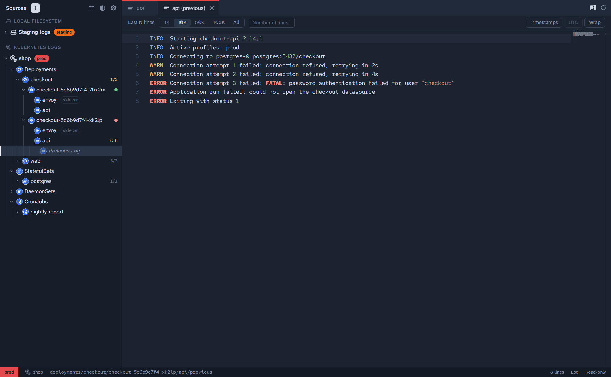

# Sources

A **Source** is one place Polyscope reads from: a folder, a bucket, a Workload's files, or a namespace's logs. You configure each one once, give it a name, and it stays in the sidebar, grouped by its Source Type.

To add one, choose **Add Source** in the empty sidebar, or **+** at its top once you have Sources, pick a **Source Type**, and fill in the rest. **Test connection** checks the settings without saving anything.

## Connecting

Every Source starts **disconnected** when Polyscope opens. Expanding it connects it. If it can't connect, the Source shows why, with a **Retry** button. Tabs aren't restored from one launch to the next, so each session starts clean.

Point at a Source's row to see its actions:

- **Refresh** lists it again. Right-click any folder or Workload to refresh just that part of the tree.
- **Disconnect** stops every live Follow of the Source but leaves its tabs open, with a **Reconnect** button.
- **Edit…**, **Duplicate** and **Delete…**. Deleting a Source forgets its settings and any secrets stored for it. What it points at is never touched.

Drag a Source to reorder it within its group. The first icon at the top of the sidebar shows or hides file sizes and modified times.

## Local Filesystem

A folder on this machine or, on Windows, a UNC share (`\\server\share\logs`).

- **Root path**: the folder to browse. **Browse…** picks it.
- **Show hidden files**: dotfiles, and files marked hidden on Windows.

Files that are still growing can be **followed** live. Polyscope notices when a followed file is truncated or rotated and carries on from the new file's start.

## S3-compatible Storage

A bucket on AWS S3, MinIO, Ceph, or any other S3-compatible store.

- **Host**: the store's address, like `https://minio.internal:9000`. Leave it blank for AWS.
- **Bucket**, and an optional **Prefix** to browse only the keys under it, like `logs/app`.
- **Region**, and **Path-style addressing**, which MinIO and most self-hosted stores need. It's on for new Sources.
- **Sign in with**:
  - **Access keys**: an access key and secret key. The secret key is stored encrypted by your operating system's secure storage (see [Privacy](privacy.md) for Linux without a keyring).
  - **AWS profile**: a profile from your AWS config and credentials files, or the default credential chain. An SSO profile needs you to have run `aws sso login` recently.
- **CA bundle**: a PEM file of extra CA certificates to trust, for stores with a private CA.
- **Verify TLS certificates**: turn it off only when you must. The Source shows a **TLS** warning while it's off.
- **Proxy**: like `http://proxy.corp:3128`. Otherwise `HTTPS_PROXY` and `NO_PROXY` apply.

S3 objects don't grow, so they can't be followed.

## Kubernetes Files

The files in one folder inside the pods of one Workload, read over `exec` the way `kubectl exec … cat` would.

- **Context**: from your kubeconfig. Polyscope reads the one `kubectl` uses (`KUBECONFIG`, or `~/.kube/config`), and auth plugins like `aws` or `kubelogin` work as they do for `kubectl`.
- **Namespace**: where the Workload is. It suggests the cluster's namespaces as you type.
- **Workload**: a Deployment, StatefulSet or DaemonSet in that namespace.
- **Path**: the absolute path of a folder in the containers, like `/var/log`. It suggests where the Workload's volumes are mounted.

Each pod shows as a folder of its own, since each pod's volumes can differ. Pods with several containers get a folder per container. Files are listed and read with `sh` and basic tools like `stat`, so containers without them (distroless images, for example) can't be browsed.

## Kubernetes Logs

Every container log in one namespace, laid out the way the cluster runs them.

- **Context** and **Namespace**, as for Kubernetes Files.

The tree groups the namespace's Workloads: **Deployments**, **StatefulSets**, **DaemonSets**, **CronJobs** (with their Jobs), **Jobs**, and any **Pods** no Workload owns. Along the way it shows:

- each Workload's **Ready Count**, like `1/2`;
- each pod's health as a coloured dot, with its status (`Running`, `CrashLoopBackOff`, `OOMKilled`…) and restarts in its tooltip;
- **init** and **sidecar** badges on the containers that start first;
- a restart count on a container that has restarted, with its **Previous Log**, the log of its run before the last restart, just below it.

Click a container to read its log, or turn on **Follow** to watch it live. See [Reading files and logs](reading.md#logs).

## Environments

An **Environment** labels a Source with what kind of system it points at. Its colour shows next to the Source in the sidebar, on its tabs, and at the left of the status bar, so a production log never passes for a staging one.

Polyscope starts with **prod**, **staging**, **qa** and **dev**. Choose one in a Source's **Environment** field, or open **Manage…** there (or **Settings → Manage Environments…**) to add, rename, recolour or delete them. You can also mark an Environment **Protected**, like prod, as one that needs extra care.
